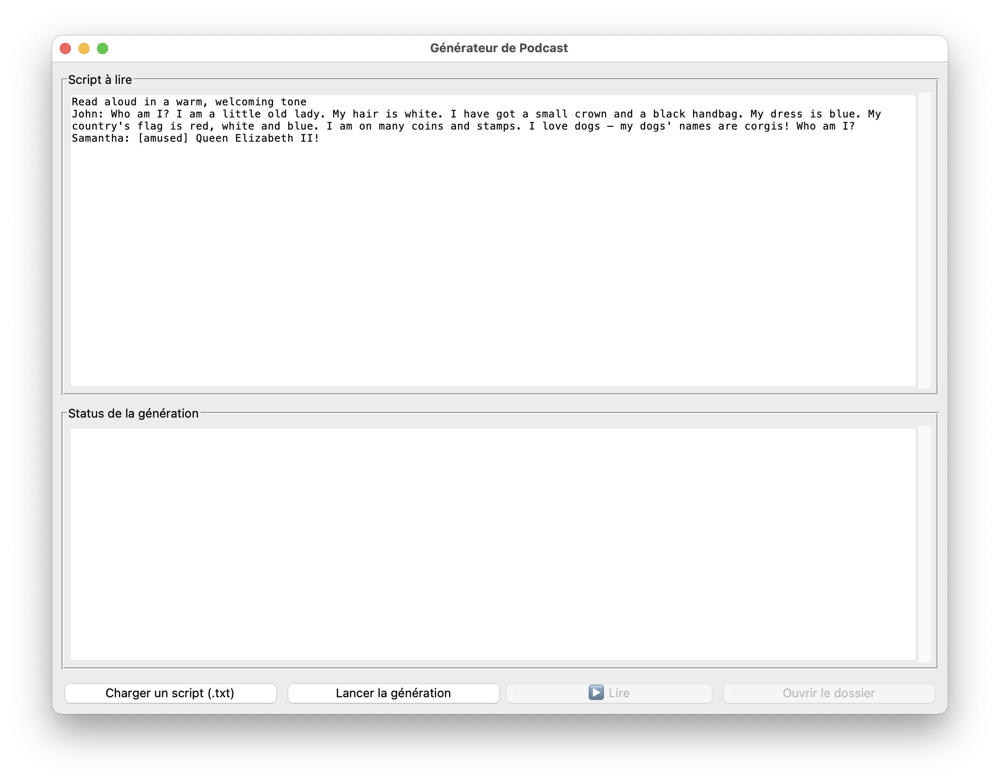

# Générateur de Podcast

Ce projet est une application de bureau simple mais puissante, développée en Python avec Tkinter, qui permet de transformer un script texte en un podcast audio multi-locuteurs en utilisant l'API de synthèse vocale de Google Gemini.



## Fonctionnalités

- Interface graphique simple avec Tkinter.
- Génération audio multi-locuteurs.
- Paramètres de voix personnalisables et sauvegardés.
- Lecture et arrêt de l'audio généré directement depuis l'application.
- Accès direct au fichier généré via le gestionnaire de fichiers du système.
- Gestion intelligente de la clé API (demandée une seule fois et sauvegardée de manière sécurisée).

## Installation (pour les développeurs)

### Prérequis
- Python 3.9 ou supérieur
- Git

### 1. Cloner le dépôt
```sh
git clone https://gitea.gandulf78.synology.me/laurent/Podcast_creator.git
cd Podcast_creator
```

### 2. Créer un environnement virtuel et installer les dépendances

```sh
# Créer l'environnement
python -m venv .venv
# Activer l'environnement (macOS/Linux)
source .venv/bin/activate
# Activer l'environnement (Windows)
# .\.venv\Scripts\activate

# Installer les dépendances
pip install -r requirements.txt
```

### 3. Configuration

Créez un fichier nommé `.env` à la racine du projet et ajoutez votre clé API Gemini :

```
GEMINI_API_KEY="VOTRE_CLE_API_ICI"
```

### 4. Lancement de l'application

```sh
python gui.py
```